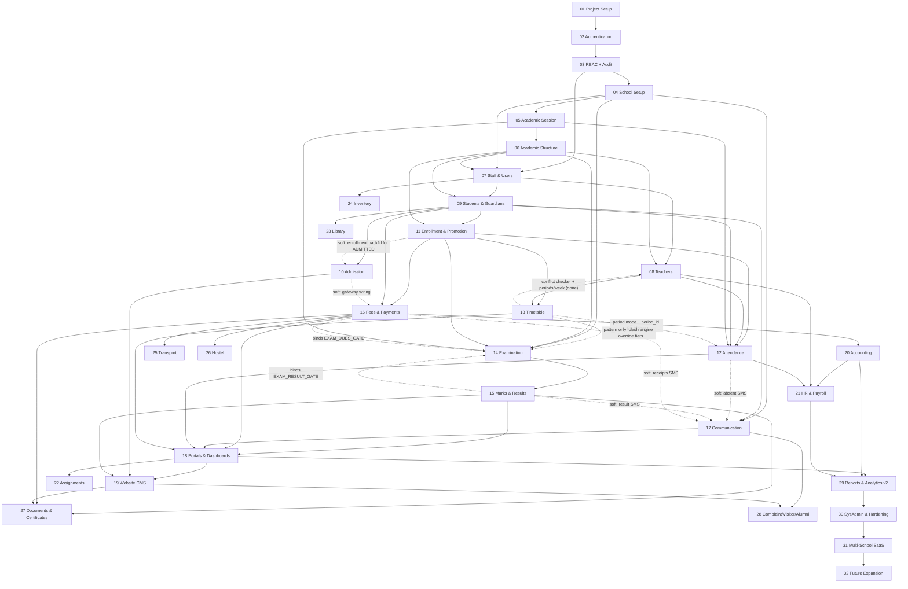

# MODULE_DEPENDENCIES.md — SMIS Module Dependency Graph

> Build order authority. A module may start only when every hard dependency is complete.
> **Legend:** solid arrow = hard dependency · `(soft)` = integration completed later via a defined hook.

## Dependency Graph (Mermaid)

## Dependency Table

| Module | Hard depends on | Soft / completed-later hooks |
|---|---|---|
| 01 Project Setup | — | — |
| 02 Authentication | 01 | — |
| 03 RBAC + Audit | 02 | — |
| 04 School Setup | 03 | — |
| 05 Academic Session | 04 | — |
| 06 Academic Structure | 05 | — |
| 07 Staff & Users | 03, 04, 06 | Provides shared SequenceService consumed by 09/10/16/20 |
| 08 Teachers | 06, 07 | Timetable conflict hook **closed by 13** (`TIMETABLE_CONFLICT_CHECKER` now binds the real checker; `TimetableConflictCheck` gained `schoolId`) and workload finalized with `periodsPerWeek`; `teacher.leave.approved` event consumed by 12; leave migrates to HR (21) |
| 09 Students & Guardians ✅ | 06, 07 | Dues hard-block on status change (16); history tabs are filled — attendance by 12, results by 15. Adjusted the M02 user-uniqueness constraint to `(school_id, user_type, contact)` so a guardian can also be staff — login now checks every candidate account. |
| 10 Admission ✅ | 06, 09 | Enrollment backfill for ADMITTED students (11 — roadmap: run 11 before the first REAL admission cycle); online gateway wiring (16); publish merit to website (19). Implementation confirmed 11 is NOT a hard dep: conversion completes at ADMITTED via the exported `StudentsService`. AuthModule newly exports `OtpService` (public phone verify). |
| 11 Enrollment & Promotion ✅ | 06, 09 | Promotion auto-decisions from results (15); rollback guard blocks once attendance (12) **or marks (15)** exist — both live. Exports the canonical roster service (`getSectionStudents`/`getStudentCurrentEnrollment`) consumed by 12/14/16. Closed the M06 section delete-guard and the M09 section-scoped batch ID-card debts. The M10 ADMITTED backfill is served by the normal enroll flow (no dedicated endpoint). |
| 12 Attendance ✅ | 05, 08, 09, 11 | Absent SMS actually sends after 17. **Period mode is now live** — 13 added the `period_id` FK and `getCurrentPeriod`. Consumed the M08 `teacher.leave.approved` hook. Added `CalendarService.workingDays()` to M05 and exports `AttendanceReportsService` + the attendance repositories for 18/21. Closed the M09 `attendance-history` debt and armed the M11 promotion rollback guard (extended to marks by M15). |
| 13 Timetable ✅ | 06, 08, 11 | **Closed the M08 `TIMETABLE_CONFLICT_CHECKER` hook** (the real `RoutineConflictChecker` is bound to the token) and finalized M08's periods/week workload stub; turned on M12 period-mode attendance. Exports `RoutineService` + `PeriodSlotsRepository` + `TimetableEntriesRepository` for 14 (exam routines reuse `period_slots`) and 18 (portal routines). Substitution-on-teacher-leave is deferred to the Phase 3 backlog. **Graph note:** the conflict checker lives in the timetable module but is *bound inside* TeacherModule over a re-provisioned repository — TimetableModule imports TeacherModule, so the reverse import would cycle. |
| 14 Examination ✅ | 04, 05, 06, 11 | **13 turned out to be a pattern dependency, not a data one** — exam sittings keep their own wall-clock `start_time`+`duration_min` rather than reusing `period_slots` (a 3-hour paper does not fit a 40-minute bell); what M13 supplied was the clash-engine technique (compare wall-clock minutes, never slot ids) and the two-tier override split. Declares two DI hooks bound to no-ops: **`EXAM_RESULT_GATE`** (15 binds it — done) and **`EXAM_DUES_GATE`** (16 binds it; `exam.admit_card_block_dues` is inert until then). **`EXAM_RESULT_GATE` is live since 15**. Extended M11 with `EnrollmentsRepository.findClassRoster()` — a paper is set per class, so its candidates span every section. Exports `ExamsService`/`ExamsRepository`/`ExamSubjectsRepository`/`ExamRoutineService` for 15 and 18. Delete guards on `exam_classes`/`exam_subjects` were slots until 15 created the marks table — **now armed**. |
| 15 Marks & Results ✅ | 14 | Result SMS becomes real with 17 (queued through the existing contract now); the public search **API is live**, 19 builds the page. **Binds `EXAM_RESULT_GATE` for real** — publication now refuses until results are processed and still describe the marks on file, which is a breaking change for any caller that walked an exam to PUBLISHED unprocessed. **Moved the grade-scale freeze from PUBLISH to the first processing run**, because results are computed before publication and were otherwise graded through a table that could still change. Armed five guards left as slots by earlier modules: M14 `exam_classes`/`exam_subjects` deletes, M06 subject removal, the M11 promotion rollback, and M09 `performance-history`. Publication visibility is the active `result_publications` row, **not** `exams.status` (the status machine cannot rewind past PUBLISHED). Exports `ResultsService`/`ResultsRepository`/`MarksRepository`/`ResultReportsService` for 18. |
| 16 Fees & Payments | 09, 11 | Receipt SMS (17); accounting auto-posting consumed by 20. **Must bind `EXAM_DUES_GATE`** so M14's admit-card dues block starts biting. |
| 17 Communication | 02, 04, 09 | Retro-wires queued events from 10/12/15/16 |
| 18 Portals & Dashboards | 02–17 | Contact-school → tickets (28) |
| 19 Website CMS | 04, 05, 10, 15, 17 | Certificate verification page completed by 27 |
| 20 Accounting | 16 | Payroll postings from 21; inventory postings from 24 |
| 21 HR & Payroll | 07, 08, 12, 20 | — |
| 22 Assignments | 08, 11, 17, 18 | LMS extension (32c) |
| 23 Library | 08, 09 | Clearance into 09/27; fine posting (20 optional) |
| 24 Inventory | 07 | Purchase posting (20 optional) |
| 25 Transport | 09, 16 | Expense posting (20 optional) |
| 26 Hostel | 09, 16 | Deposit voucher (20 optional) |
| 27 Documents & Certificates | 09, 15, 16, 19 | Clearance aggregates 16/23/26 |
| 28 Complaint / Visitor / Alumni | 07, 09, 17, 19 | Donation posting (20 optional) |
| 29 Reports & Analytics v2 | 18, 20, 21 (all Phase 1–2 data) | — |
| 30 SysAdmin & Hardening | all prior | — |
| 31 Multi-School SaaS | 30 | — |
| 32 Future Expansion | 30–31 baseline; per sub-project | — |

## Parallelization Opportunities (if a second developer joins)

- After 07: **08 (Teachers)** ∥ **09 (Students)**.
- After 11: **12 (Attendance)** ∥ **13 (Timetable)** ∥ **16 (Fees)**.
- After 18: **19 (Website)** ∥ **20 (Accounting)**; later **22–26** are mutually independent.

## Critical Path

`01 → 02 → 03 → 04 → 05 → 06 → 07 → 09 → 11 → 14 → 15 → 18` — protect this chain; everything else can flex around it.

*(Updated after M14: 13 is no longer on the critical path. It was scheduled before 14 on the assumption that exam scheduling would reuse `period_slots`; implementation showed sittings need their own wall-clock timing, so 13 contributed patterns rather than data and 14 could have run in parallel with it.)*

## Update Rule

When implementation reveals a new dependency (or removes one), update the Mermaid graph, the table row(s), and note the change in that module's completion document under **Links to related modules**.
